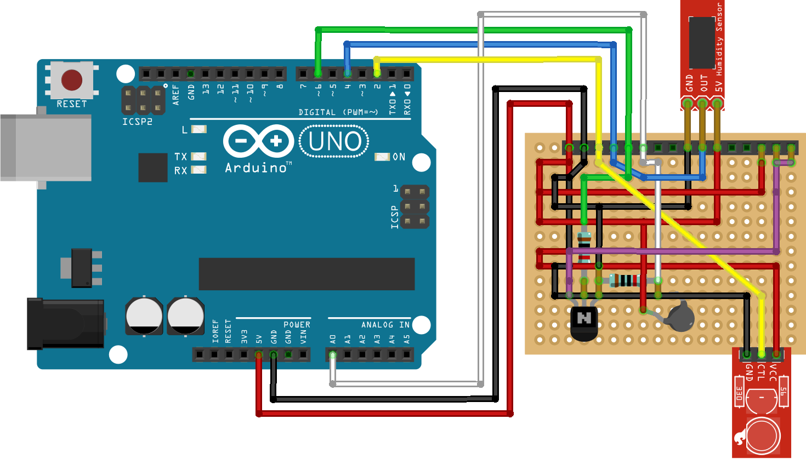
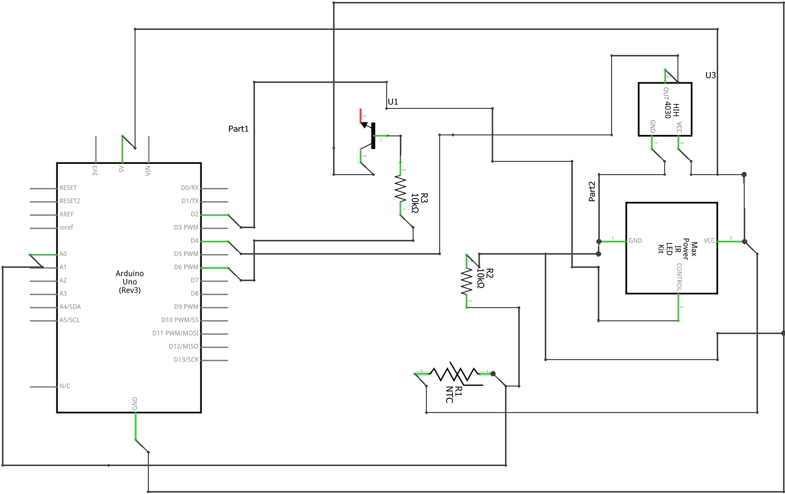

# Stygain/fan-controller
This fan-controller application is a project combining Arduino with a Windows forms application.

# Windows Forms
The Windows forms application provides information to the Arduino and gives an interface for fan speed and temperature unit control. The application sends the time and RSS feed headlines to the Arduino to display on the LCD (marquis-style).

# Arduino
The Arduino side of this project implements fan speed control with an interface through an IR remote and the COM port. Additionally, attached to the Arduino are a thermistor and DHT (temperature and humidity sensor) to determine ambient case temperature.

# Boardview
The rightmost female headers go to the LCD sheild (1 pin) and the fan wires (2 pins).

# Schematic
Missing LCD sheild

